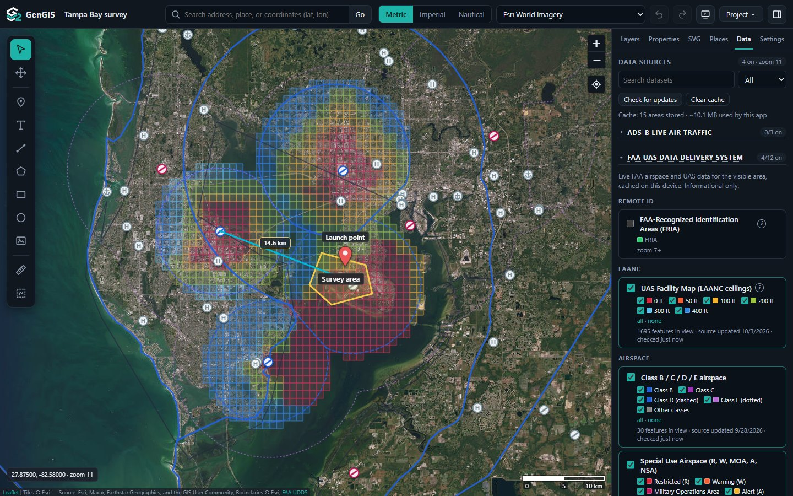
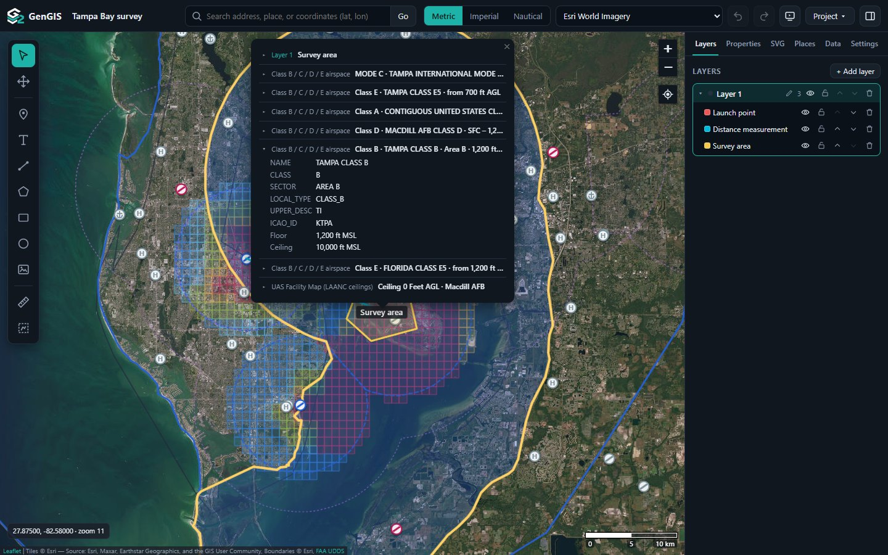
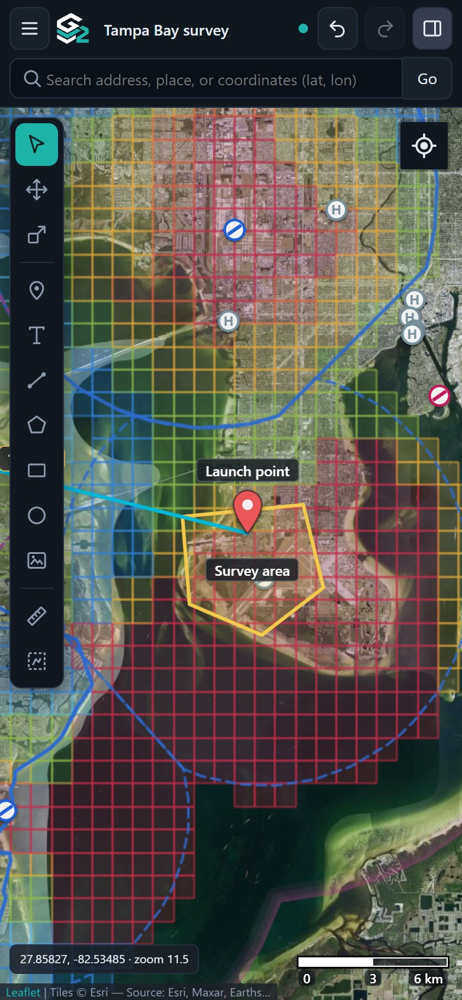
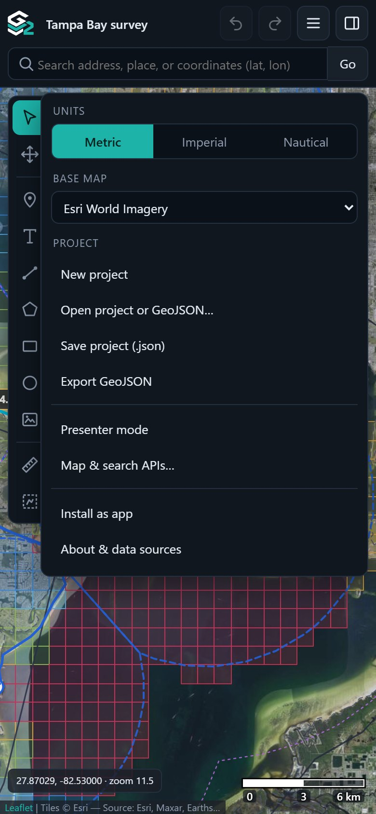
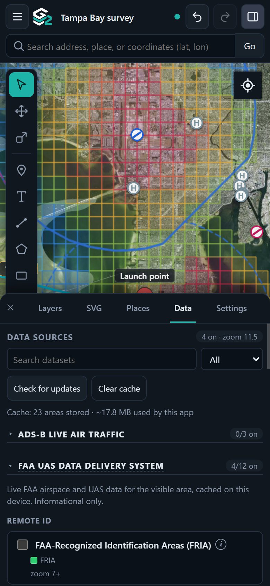

# GenGIS (G²)


**[Open GenGIS → g2.luiscintron.com](https://g2.luiscintron.com)** · [Desktop installers](https://github.com/lcintron/gengis/releases/latest)

Version 0.5.0

A free map builder that runs in the browser (installable, works offline) or as a desktop app. Draw and measure on the map, organize your work in layers, and overlay live FAA airspace, LAANC ceilings and air traffic. No account or API key needed.





<p align="center">
  
  
  
</p>

## Features

- **Draw and edit** markers, text, lines, polygons, rectangles, circles and SVG images, with snapping, multi-select, joining lines into shapes, name labels and full styling. By default, each new object gets its own color.
- **Measure** distances and areas in metric, imperial or nautical units, with a scale bar.
- **Layers** with show/hide, lock and draw order; undo/redo; right-click menus; presenter mode.
- **Projects** save automatically on the device as you work, with recent projects and earlier copies to restore (Project → Recent projects); save/open as `.gengis.json`; GeoJSON import/export.
- **Project files in the desktop app**: each named project is also kept as a file, `Documents\GenGIS\<name>.gengis.json` by default (Settings → Project to pick another folder), saved a moment after every change and when the window closes; Save as… and recent files under Project → Recent projects.
- **Search** addresses, places and coordinates; find points of interest; center on **your location**.
- **FAA data**, live for the area in view: Class B–E airspace with floors and ceilings, special use airspace, LAANC ceilings, security flight restrictions, TFRs, airports (with radio frequencies) and more. Click anywhere to see everything under that point. Any public ArcGIS layer can be added.
- **Live air traffic (ADS-B)** from your own dump1090 receiver or the adsb.fi and adsb.lol networks, with type icons colored by altitude and aircraft look-up.
- **Base maps**: Esri World Imagery (default), OpenStreetMap, OpenTopoMap, CyclOSM, CARTO, plus your own XYZ/WMS or keyed providers.
- **Offline**: download map tiles and data for an area ahead of time.

Informational only: not for navigation or flight authorization.

## Run it yourself

```bash
node serve.js 8080      # web app at http://localhost:8080
npm install && npm start  # desktop app (Electron)
```

Any static web server works for the web app. Open it with a location: `?q=Eiffel+Tower`, `?lat=48.858&lon=2.294&zoom=16` or `?poi=cafe`.

### Live air traffic: where it works

Browsers only read another server's data when it allows them to (CORS), and block plain-HTTP requests from an HTTPS page. The desktop app has neither limit.

| Source | Desktop app | Web app over `http://` | Web app over HTTPS |
| --- | --- | --- | --- |
| dump1090 that sends CORS headers (dump1090-fa, tar1090) | yes | yes | only on `localhost` or over HTTPS |
| dump1090 without CORS headers | yes | no | no |
| adsb.fi, adsb.lol | yes | no | no |

## Releasing

Releases run in CI on demand: **Actions → Release → Run workflow** on `main` (or `gh workflow run release.yml -f bump=auto`). By default, the version bump is derived from conventional commits (or choose one in the form). The workflow tags the release, builds Windows, macOS and Linux installers, publishes a GitHub Release, and deploys the site. **Dry run** only reports the version it would release. `make serve`, `make build` and `make release DRY=1` do the same locally.

## Keyboard shortcuts

| Key | Action |
| --- | --- |
| V / G | Select / Move |
| M / T / L / P / R / C / S | Marker, Text, Line, Polygon, Rectangle, Circle, SVG |
| D / A | Measure distance / area |
| F | Presenter mode |
| Esc / Delete | Cancel or deselect / delete |
| Ctrl/Cmd + Z / Y / D / S | Undo / redo / duplicate / save |
| / | Search |

## Data sources and fair use

Map tiles, [Nominatim](https://operations.osmfoundation.org/policies/nominatim/) search and the [Overpass API](https://wiki.openstreetmap.org/wiki/Overpass_API) are free public services with their own usage policies; attribution is shown on the map. FAA data comes from the [FAA UAS Data Delivery System](https://udds-faa.opendata.arcgis.com/). Air traffic from [adsb.fi](https://github.com/adsbfi/opendata) is for personal, non-commercial use and [adsb.lol](https://adsb.lol) is ODbL; the app polls no faster than each allows. For heavy use, point the app at your own servers (Project → Map & search APIs).

## License

[MIT](LICENSE). Bundled Leaflet (BSD 2-Clause) and Leaflet-Geoman (MIT) keep their own licenses.
